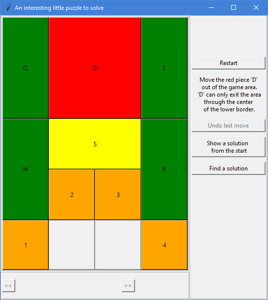
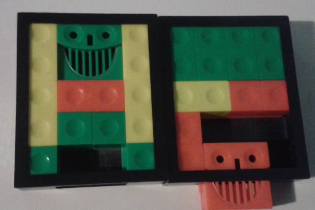

# Puzzlegame

A cute little children's puzzle as a Python program with GUI via tkinter. However, this one does not have candy as a reward for solving it, since one can simply press the *find a solution* button.

Launch the game by typing

`python play.py`

You can select a piece by clicking or pressing the key corresponding to its "name". Once selected, the piece can be moved with arrow keys or by clicking on an empty spot. Alternatively, you can just drag the pieces around.

This is the real life puzzle which inspired this project.

### Currently working on
- reworking Positions class (maybe changes to Puzzlegame class as well)
- borders to the playing area (is it good now?)
- saving positions to databases instead of files

### Possible issues
- 324 solved pos not marked as solved
- 176 not solved positions marked as solved
- Trying to move the big piece out of the puzzle area should maybe give a better response than "cannot move down".
- Solver does not distinguish between mirrored positions, which might cause problems.

### Recent changes
- Switched around the parameters of Positions class initializer
- This necessitated changes to a lot of the other files as well
- Added distance_to_end property to Positions
- .reflect() does not create a new Positions object anymore, only a tuple
- .make_move() can have direction (forwards or backwards)

### Things to add maybe
- classes for pieces??
- exploring weird paths (far from solutions)
- would qt be better than tkinter?
